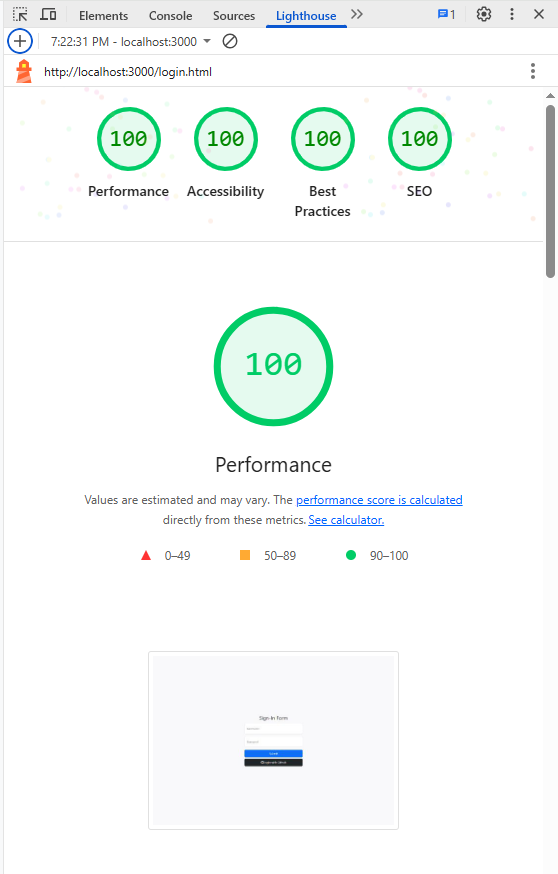
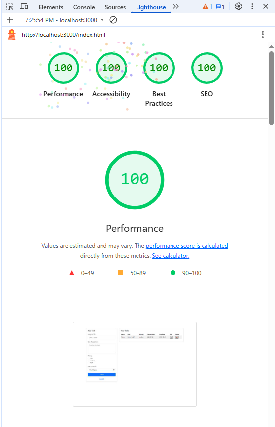

## To Do Application
Author: Ayush Kulkarni

Render Link: https://a3-ayushkulkarni.onrender.com/
Railway Link: https://a3-ayushkulkarni-production.up.railway.app/
I have the following accounts already set up:
- Username: admin   Password: admin   1 task
- Username: Ayush   Password: 1234    2 tasks
- My GitHub authenticated account     0 tasks

The goal of this application was to design a To Do Application that will allow each user to view, edit, and delete their tasks. 
My biggest challenge when designing this application was the styling and auth0 github authentication. 
I chose to use GitHub for authentication because I originally designed the application with a simple username and password stored in a database, so I thought that adding a GitHub login would be a good addition.
I used Bootstrap for a CSS framework because that is a framework I have used in the past. I modified the CSS framework by making the application use up 100% of the available height, center and add spacing to elements, and change the font-display to get a higher score on the Google Lighthouse tests.
Express middleware packages used:
- Express: I use this to serve routes such as '/data', 'index.html', 'login.html'
- Express.json(): I use this to read requests as JSON objects
- Express.urlencoded(): I use this to parse data from POST requests
- Express.static(): I use this to serve static files in the public folder (my html and frontend js files)
- Express-session: I use this to maintain login state in between sessions for the username and login
- Passport: I use this for Auth0 implementation for GitHub
- queryString(): I use this to parse query strings, used in my logout route

## Technical Achievements
- **Tech Achievement 1**: I used OAuth authentication via the GitHub strategy
- **Tech Achievement 2**: I used Railway to host my application.
Overall, the experience on Railway was a lot smoother than Render. However, when I first created my account, the website crashed and forced me to restart my computer. This fixed almost all of the issues and the rest of the deployment was fairly straightforward. One thing that is worse in Railway than Render is the User Interface of the website. One thing better in Railway is redeploying the application after making changes to environment variables or the GitHub repository. 
Note: I also deployed the application on Render as a backup because I had a couple of issues depoying to Railway
- **Tech Achievement 3**: I achieved 100% on all 4 Google Lighthouse tests for my login page and main application page
Login.html: 
Index.html: 
- **Tech Achievement 4**: I recieved a 100% on all tests except performance on mobile and over 95% on performance on mobile for both pages. This involved adding a viewport tag in the header for the device width and making sure my styling was done as a percentage of the available width (width: 100%) instead of a fixed size. I believe I should get 3 points for this achievement.
- **Tech Achievement 5**: I implemented a "required login" function so that routes like '/index.html' and '/data' are inaccessible unless the user is signed in. This prevents users from misusing the application by just entering the '/index.html' and bypassing the login system. I believe I should get 3 points for this achievement.

